# Guía práctica y visual de Crewly

Esta guía explica cómo usar Crewly de principio a fin: preparar la instalación, crear un proyecto, formar un equipo de agentes, asignar trabajo, supervisar la ejecución y revisar memoria, costos y seguridad.

Las imágenes pertenecen a la instalación local real. Algunos controles todavía pueden aparecer en inglés; por eso se indica también el texto que puede verse en pantalla, por ejemplo **Nuevo equipo / New Team**.

## Contenido

1. [La interfaz en un vistazo](#1-la-interfaz-en-un-vistazo)
2. [Primera configuración](#2-primera-configuración)
3. [Crear un proyecto](#3-crear-un-proyecto)
4. [Crear un equipo y configurar sus agentes](#4-crear-un-equipo-y-configurar-sus-agentes)
5. [Iniciar el equipo y enviar una tarea](#5-iniciar-el-equipo-y-enviar-una-tarea)
6. [Supervisar y verificar el trabajo](#6-supervisar-y-verificar-el-trabajo)
7. [Todos los menús y módulos](#7-todos-los-menús-y-módulos)
8. [Flujo recomendado de trabajo](#8-flujo-recomendado-de-trabajo)
9. [Comprobación rápida y solución de problemas](#9-comprobación-rápida-y-solución-de-problemas)

## 1. La interfaz en un vistazo

Abre Crewly desde el acceso directo **Crewly** de Windows o visita `http://localhost:8787`.

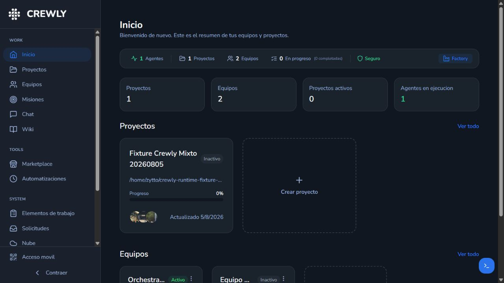

La pantalla tiene cuatro zonas:

| Zona | Para qué sirve |
|---|---|
| Barra lateral izquierda | Abre todos los módulos: trabajo, herramientas, sistema y ayuda. |
| Área central | Muestra el módulo seleccionado y sus acciones. |
| Botón azul `>_` | Abre o cierra la terminal en vivo. |
| Acceso móvil | Muestra el código QR para abrir la instalación desde un dispositivo autorizado. |

En **Inicio** revisa primero:

- agentes disponibles y en ejecución;
- proyectos y equipos existentes;
- tareas en progreso y completadas;
- estado general de seguridad;
- tarjetas rápidas para crear un proyecto o un equipo.

## 2. Primera configuración

Antes de crear trabajo, abre **Configuración**.

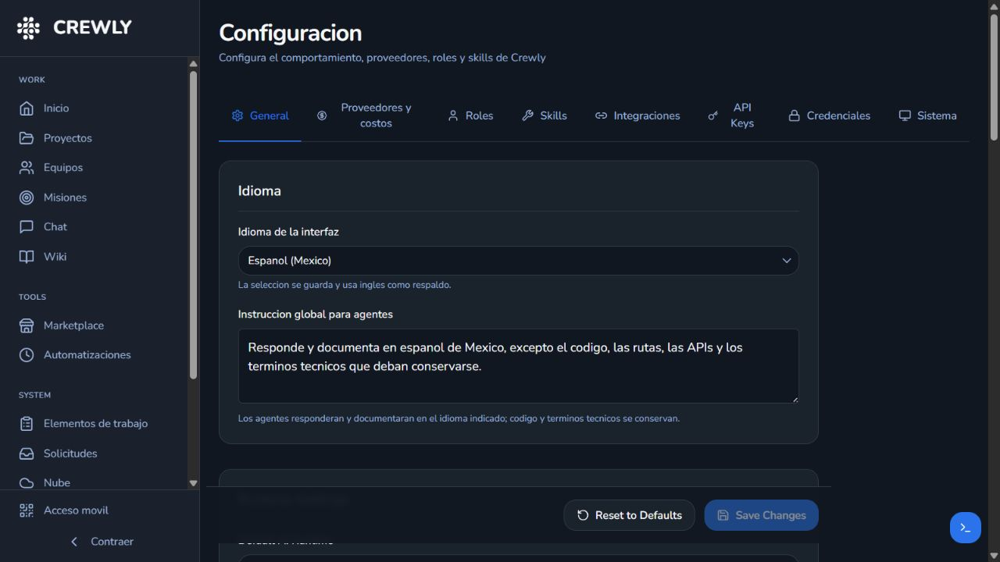

### Paso 1: idioma e instrucción global

En la pestaña **General**:

1. Selecciona **Español (México)**.
2. Conserva una instrucción global similar a: “Responde y documenta en español de México, excepto código, rutas, APIs y términos técnicos”.
3. Elige el runtime predeterminado para agentes nuevos.
4. Define el número máximo de agentes concurrentes.
5. Activa seguimiento de tokens si quieres usar el módulo **Uso**.
6. Guarda los cambios.

### Paso 2: comprobar proveedores reales

Abre **Configuración > Proveedores y costos**.

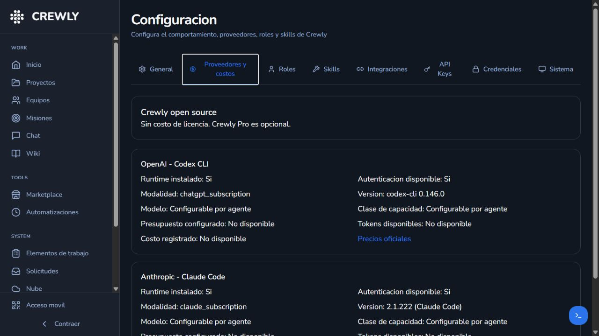

Comprueba que cada proveedor muestre:

- `Runtime instalado: Sí`;
- `Autenticación disponible: Sí`;
- versión del CLI;
- modalidad de autenticación;
- modelo y capacidad configurables por agente.

Un binario instalado no prueba que la sesión esté autenticada. No inicies un equipo hasta ver **Autenticación disponible: Sí**.

### Paso 3: revisar las demás pestañas

| Pestaña | Uso práctico |
|---|---|
| General | Idioma, runtime predeterminado, concurrencia, intervalos, chat y comandos CLI. |
| Proveedores y costos | Disponibilidad real de Claude/Codex, modalidad de acceso y referencia de precios. |
| Roles | Define responsabilidades y prompts base de los agentes. |
| Skills | Revisa las habilidades instaladas y las asignadas por rol. |
| Integraciones | Configura Slack, WhatsApp y otros canales disponibles. |
| API Keys | Administra claves de proveedores que requieren API; nunca las pegues en Chat. |
| Credenciales | Gestiona credenciales reutilizables y su estado. |
| Sistema | Salud, mantenimiento, respaldos y opciones operativas. |

## 3. Crear un proyecto

Un proyecto vincula Crewly con una carpeta real de trabajo.

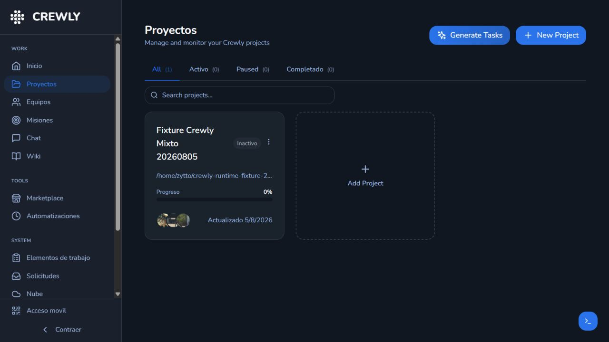

1. Abre **Proyectos**.
2. Pulsa **Nuevo proyecto / New Project** o la tarjeta **Crear proyecto**.
3. Escribe un nombre reconocible.
4. Selecciona la ruta del repositorio o carpeta de trabajo.
5. Confirma que la ruta sea de Linux dentro de WSL, por ejemplo `/home/usuario/proyecto`; evita `/mnt/c` para Crewly.
6. Guarda el proyecto.
7. Verifica que la tarjeta muestre nombre, ruta, estado y progreso.

Recomendación: crea un proyecto por repositorio o producto. No reutilices el mismo proyecto para trabajos sin relación.

## 4. Crear un equipo y configurar sus agentes

Abre **Equipos** para ver equipos activos, inactivos, proyecto asignado y miembros.

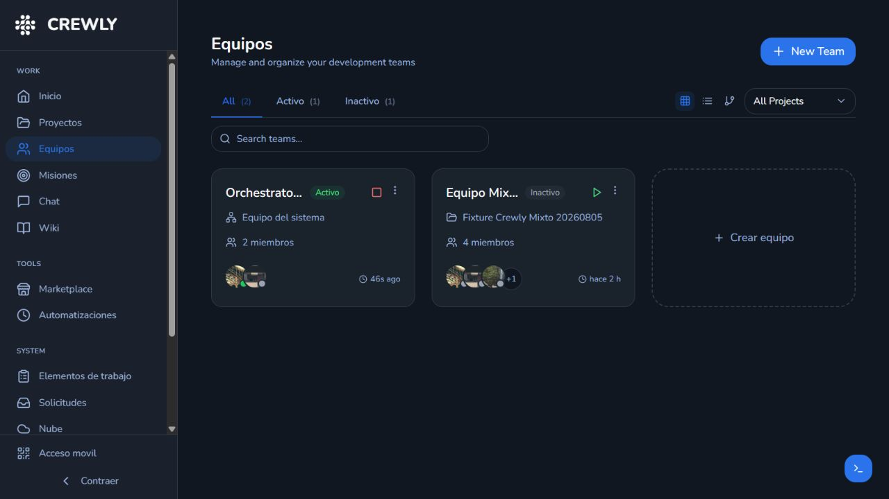

Pulsa **Nuevo equipo / New Team**.

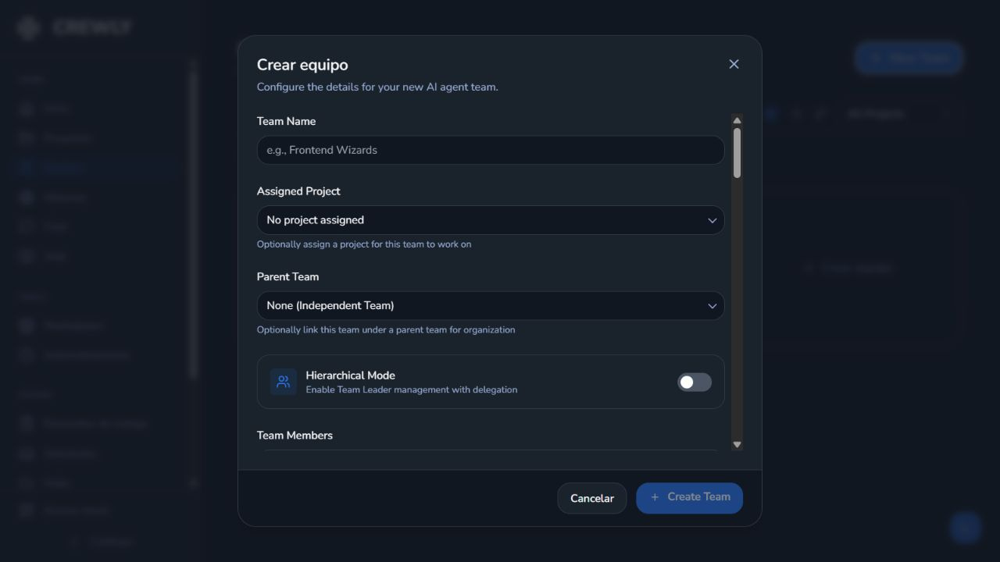

### Datos del equipo

1. Asigna un nombre, por ejemplo `Equipo Producto`.
2. Selecciona el proyecto creado anteriormente.
3. Usa **Parent Team** sólo si este equipo dependerá de otro.
4. Activa **Hierarchical Mode** cuando necesites un líder que delegue y coordine.

### Configurar cada agente

Para cada miembro define:

| Campo | Qué elegir |
|---|---|
| Agent Name | Nombre corto y único, como `Líder`, `Developer` o `QA`. |
| Role | La responsabilidad real del agente. |
| Runtime Type | `Claude CLI`, `Codex CLI`, Gemini o Crewly Agent. |
| Provider | Proveedor explícito o predeterminado del runtime. |
| Model Selection | Manual o selección automática más económica que cumpla la capacidad. |
| AI Model | Identificador `provider/model` sólo cuando quieras fijarlo manualmente. |
| Fallback Model | Modelo alternativo opcional. |
| Max Tokens / Task | Tope de tokens por tarea. |
| Max USD / Task | Presupuesto máximo cuando el proveedor permita calcularlo. |
| External Memory Layer | Memoria suplementaria; no sustituye la memoria ni la Wiki nativas. |
| Skills | Habilidades adicionales o heredadas del rol. |

### Equipo inicial recomendado

Para empezar sin consumir demasiados recursos:

- **Líder:** Claude Code, rol Team Leader.
- **Developer:** Codex CLI, selección automática, capacidad de programación fuerte.
- **QA:** Claude Code o Codex CLI, contexto independiente.
- **Documentación:** añádelo después de medir el consumo; puede usar memoria externa suplementaria.

Empieza con dos agentes concurrentes y amplía el equipo después de medir una semana.

### Comprobar la configuración

Después de guardar, abre la tarjeta del equipo.

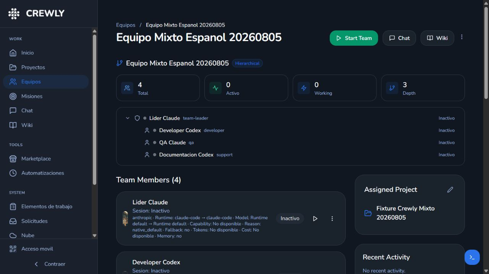

Comprueba en cada miembro:

- runtime solicitado y ejecutado;
- proveedor y modelo;
- clase de capacidad y motivo de selección;
- uso o no de fallback;
- presupuesto, tokens y costo cuando estén disponibles;
- estado de Memory Layer y referencias consultadas.

## 5. Iniciar el equipo y enviar una tarea

### Paso 1: iniciar

1. En **Equipos**, pulsa el botón de inicio de la tarjeta o **Start Team** dentro del detalle.
2. Espera a que los agentes necesarios cambien a **Activo**.
3. Abre la terminal con el botón azul `>_` si quieres ver el proceso real del runtime.

### Paso 2: enviar por Chat

Abre **Chat**.

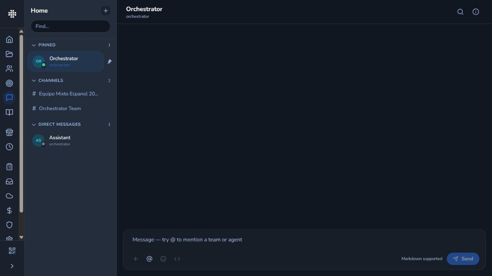

1. Elige el canal del equipo o un agente directo.
2. Describe objetivo, resultado esperado, límites y pruebas.
3. Menciona al equipo o agente cuando sea necesario.
4. Envía el mensaje.
5. No pegues tokens, contraseñas ni secretos en el chat.

Ejemplo de tarea útil:

> Corrige la validación del formulario, agrega una prueba del caso vacío, solicita una revisión independiente de QA y documenta el resultado en español. No cambies módulos fuera del formulario.

Una buena solicitud contiene:

- **objetivo:** qué debe cambiar;
- **alcance:** archivos o módulo autorizado;
- **aceptación:** cómo se demostrará que funciona;
- **restricciones:** qué no debe tocarse;
- **idioma y formato:** cómo debe responder el equipo.

## 6. Supervisar y verificar el trabajo

### Solicitudes

**Solicitudes** es la bandeja de entrada. Muestra trabajo recibido desde chat, integraciones u otros canales. Úsala para filtrar tareas activas, bloqueadas, en espera o terminadas y detectar solicitudes urgentes.

### Elementos de trabajo

**Elementos de trabajo** muestra la ejecución interna: delegaciones, verificaciones, estados, agente asignado e identificador.

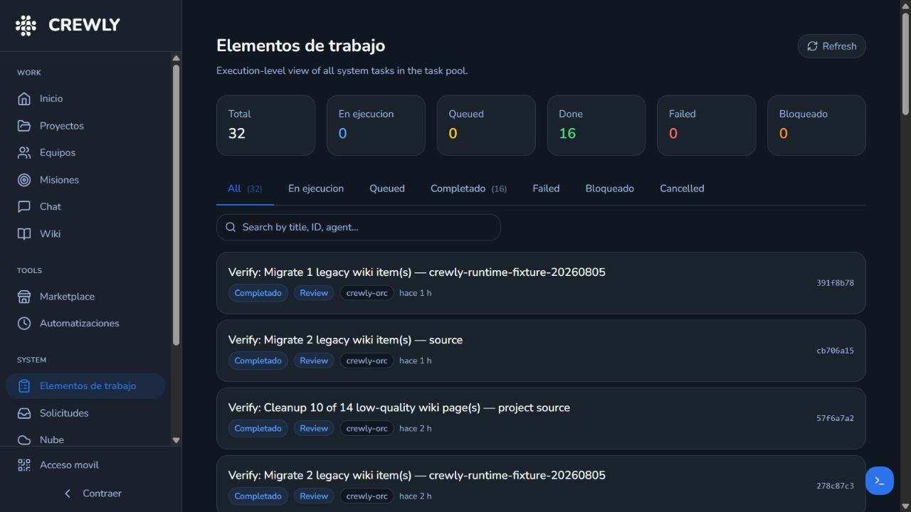

Úsalo para:

1. localizar la tarea por nombre o ID;
2. comprobar si está en cola, ejecutándose, completada, bloqueada o fallida;
3. abrir la tarea y revisar evidencia;
4. confirmar que QA produjo un veredicto independiente;
5. distinguir la tarea original de sus verificaciones y subtareas.

### Terminal en vivo

La terminal inferior muestra la sesión real del agente. Es la mejor evidencia de que Crewly lanzó `claude`, `codex` u otro runtime.

- Selecciona una sesión en el desplegable.
- Revisa comandos, pruebas y errores.
- No confundas “terminal conectada” con “tarea aceptada”: confirma también el resultado en Elementos de trabajo.
- La salida cruda no se traduce.

### QA y retrabajo

Un flujo robusto debe tener estas puertas:

1. Developer modifica el código.
2. Developer ejecuta pruebas.
3. QA revisa en contexto independiente.
4. QA emite `PASS` o `FAIL` con evidencia.
5. Si falla, el líder devuelve trabajo específico al Developer.
6. El líder entrega sólo cuando la aceptación está completa.

## 7. Todos los menús y módulos

### Grupo Trabajo

| Menú | Para qué sirve | Acción típica |
|---|---|---|
| Inicio | Resumen general de proyectos, equipos, agentes y seguridad. | Detectar rápidamente qué está activo o bloqueado. |
| Proyectos | Registra carpetas/repositories y muestra progreso. | Crear el proyecto antes de formar el equipo. |
| Equipos | Crea y administra agentes, roles, jerarquía, runtimes y modelos. | Iniciar, detener o editar un equipo. |
| Misiones | Define objetivos estratégicos u OKRs con prioridad y periodo. | Crear una misión y relacionarla con un equipo. |
| Chat | Conversaciones directas, canales de equipo y grupos multiagente. | Enviar una solicitud con criterios de aceptación. |
| Wiki | Base de conocimiento global, de proyecto y de equipo. | Buscar decisiones, patrones, runbooks y páginas canónicas. |

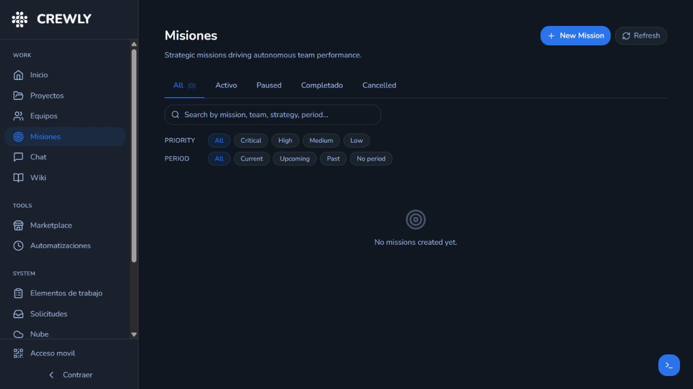

### Grupo Herramientas

| Menú | Para qué sirve | Precaución |
|---|---|---|
| Marketplace | Explora skills, roles, modelos y herramientas MCP. | Revisa requisitos y permisos antes de instalar. |
| Automatizaciones | Programa tareas y reacciona a eventos como tarea completada, bloqueada o fallida. | Evita ciclos que creen tareas repetidas sin límite. |

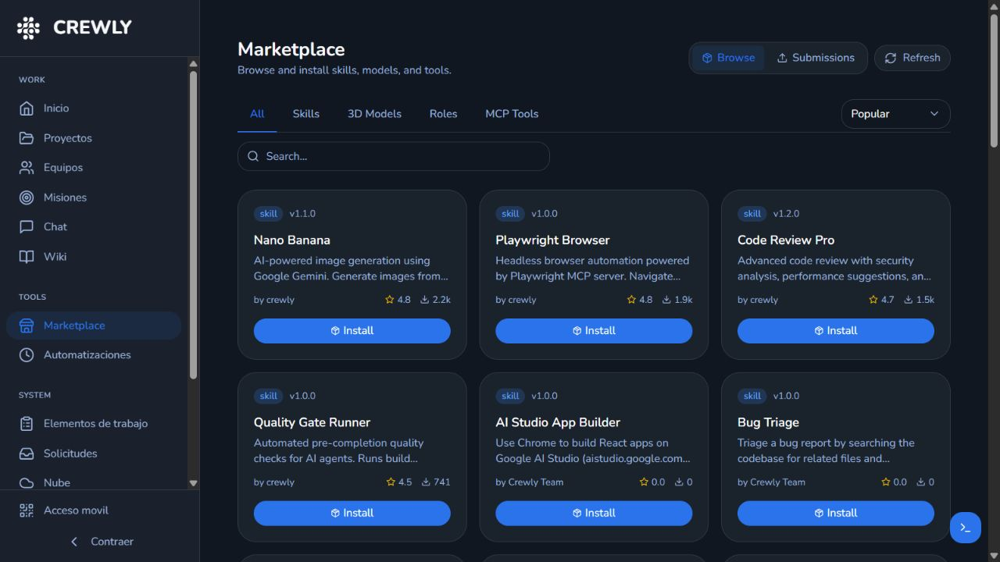

En **Automatizaciones** puedes crear:

- tareas programadas por horario;
- señales basadas en eventos;
- acciones dirigidas a un equipo o agente;
- automatizaciones pausables y revisables por última/próxima ejecución.

### Grupo Sistema

| Menú | Para qué sirve | Qué comprobar |
|---|---|---|
| Elementos de trabajo | Vista técnica de todas las ejecuciones. | Estado, agente, tipo, tiempo e ID. |
| Solicitudes | Bandeja de trabajo entrante. | Prioridad, asignación, bloqueo y costo. |
| Nube | Dispositivos, relay/extensión y conexión opcional a CrewlyAI Cloud. | No es necesaria para el uso local. |
| Uso | Tokens, costos registrados, agentes activos y presupuestos. | Contrasta importes con la facturación oficial del proveedor. |
| Seguridad | Aislamiento de agentes, almacenamiento local y auditoría de aprobaciones. | Revisa alertas y reportes antes de ampliar permisos. |
| Configuración | Idioma, runtime, roles, skills, integraciones, claves, credenciales y sistema. | Guarda cambios y reinicia sólo cuando la opción lo indique. |
| Ayuda | Índice de guías en español. | Abre la guía específica del módulo que estés usando. |

Los costos de **Uso** son registros de Crewly; no sustituyen el portal de facturación de OpenAI, Anthropic u otro proveedor.

### Wiki, memoria y conocimiento

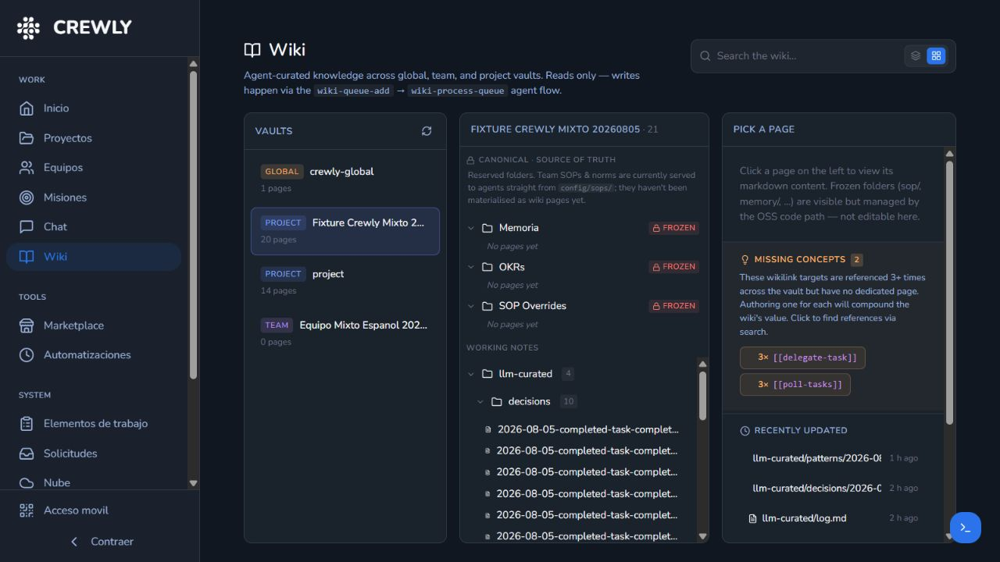

La Wiki separa bóvedas globales, de proyecto y de equipo. Las carpetas canónicas o congeladas son de sólo lectura en la interfaz; los agentes escriben mediante el flujo nativo de cola y procesamiento.

- **Wiki:** conocimiento navegable y curado.
- **Memoria nativa:** aprendizajes, decisiones, patrones y contexto operativo.
- **Memory Layer externa:** suplemento opcional; nunca reemplaza las dos anteriores.

### Acceso móvil y terminal

- **Acceso móvil:** abre un QR para enlazar un dispositivo autorizado.
- **Terminal `>_`:** abre las sesiones PTY reales de los agentes.
- **Contraer:** reduce la barra lateral y deja más espacio al módulo central.

### Ayuda y guías detalladas

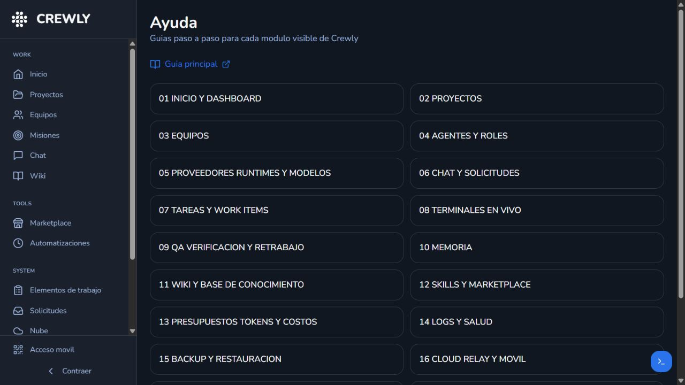

La pantalla **Ayuda** enlaza las siguientes guías especializadas:

- [Inicio y dashboard](01-INICIO-Y-DASHBOARD.md)
- [Proyectos](02-PROYECTOS.md)
- [Equipos](03-EQUIPOS.md)
- [Agentes y roles](04-AGENTES-Y-ROLES.md)
- [Proveedores, runtimes y modelos](05-PROVEEDORES-RUNTIMES-Y-MODELOS.md)
- [Chat y solicitudes](06-CHAT-Y-SOLICITUDES.md)
- [Tareas y elementos de trabajo](07-TAREAS-Y-WORK-ITEMS.md)
- [Terminales en vivo](08-TERMINALES-EN-VIVO.md)
- [QA, verificación y retrabajo](09-QA-VERIFICACION-Y-RETRABAJO.md)
- [Memoria](10-MEMORIA.md)
- [Wiki y base de conocimiento](11-WIKI-Y-BASE-DE-CONOCIMIENTO.md)
- [Skills y Marketplace](12-SKILLS-Y-MARKETPLACE.md)
- [Presupuestos, tokens y costos](13-PRESUPUESTOS-TOKENS-Y-COSTOS.md)
- [Logs y salud](14-LOGS-Y-SALUD.md)
- [Backup y restauración](15-BACKUP-Y-RESTAURACION.md)
- [Cloud relay y móvil](16-CLOUD-RELAY-Y-MOVIL.md)
- [Slack](17-SLACK.md)
- [WhatsApp/Baileys](18-WHATSAPP-BAILEYS.md)
- [Configuración](19-CONFIGURACION.md)
- [Solución de problemas](20-SOLUCION-DE-PROBLEMAS.md)
- [Costos y suscripciones](COSTOS-Y-SUSCRIPCIONES.md)

## 8. Flujo recomendado de trabajo

Usa este orden para una tarea real:

1. **Configuración:** confirma idioma, runtime y autenticación.
2. **Proyecto:** registra la carpeta correcta.
3. **Equipo:** asigna roles, runtime, modelo, presupuesto y proyecto.
4. **Inicio del equipo:** comprueba que sólo se inicie una instancia.
5. **Chat:** envía objetivo, alcance, aceptación y restricciones.
6. **Solicitudes:** confirma que Crewly recibió el trabajo.
7. **Elementos de trabajo:** sigue delegaciones y estados.
8. **Terminal:** observa runtime, comandos y pruebas reales.
9. **QA:** exige veredicto independiente.
10. **Wiki/memoria:** verifica que el aprendizaje quede preservado.
11. **Uso:** revisa tokens y presupuesto.
12. **Seguridad:** revisa aprobaciones y aislamiento.
13. **Entrega:** acepta sólo con evidencia y respuesta final clara.
14. **Detención:** detén el equipo cuando termine para evitar consumo concurrente.

## 9. Comprobación rápida y solución de problemas

### Lista de aceptación

- [ ] Crewly abre en `http://localhost:8787`.
- [ ] La interfaz usa `es-MX`.
- [ ] Claude y/o Codex aparecen instalados y autenticados.
- [ ] El proyecto apunta a la carpeta correcta dentro de WSL.
- [ ] Cada agente tiene rol, runtime y modelo/capacidad definidos.
- [ ] El equipo inicia sin duplicar procesos.
- [ ] Chat crea una solicitud visible.
- [ ] Elementos de trabajo muestra la ejecución y sus subtareas.
- [ ] La terminal evidencia el runtime real.
- [ ] Las pruebas y QA terminan correctamente.
- [ ] Wiki y memoria nativas permanecen activas.
- [ ] Uso y presupuestos son razonables.
- [ ] No se expusieron secretos.

### Problemas frecuentes

| Síntoma | Qué hacer |
|---|---|
| Runtime instalado pero no autenticado | Completa el login en Ubuntu WSL2 y vuelve a abrir Proveedores y costos. |
| Agente no inicia | Revisa el comando CLI en Configuración > General y abre la terminal para ver el error. |
| Tarea no aparece | Confirma canal/equipo en Chat y revisa Solicitudes. |
| Tarea queda bloqueada | Abre Elementos de trabajo, identifica la dependencia y responde al agente o líder. |
| Modelo distinto al esperado | Revisa Model Selection, capability class, fallback y recibo de ejecución del agente. |
| Costo “No disponible” | El proveedor no entregó el dato; no lo sustituyas por cero. |
| Texto todavía en inglés | Usa el nombre equivalente indicado en esta guía; no se traduce salida cruda ni contenido de terceros. |
| Wiki vacía | Selecciona la bóveda correcta y procesa la cola nativa de Wiki. |
| La terminal dice desconectado | Inicia el agente o selecciona una sesión activa. |
| El acceso directo no abre | Consulta [Solución de problemas](20-SOLUCION-DE-PROBLEMAS.md) y revisa los logs locales. |

## Reglas de seguridad

- No pegues contraseñas, tokens, cookies ni claves en Chat o terminales compartidas.
- No uses un proveedor como “disponible” sólo porque existe el binario.
- Revisa skills y automatizaciones antes de habilitarlas.
- Mantén presupuestos por tarea y límites de concurrencia.
- Detén equipos inactivos.
- Haz respaldos antes de restauraciones o cambios de sistema.
- Mantén Wiki y memoria nativas aunque uses una Memory Layer externa.
